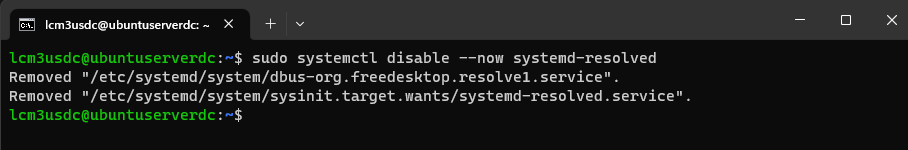
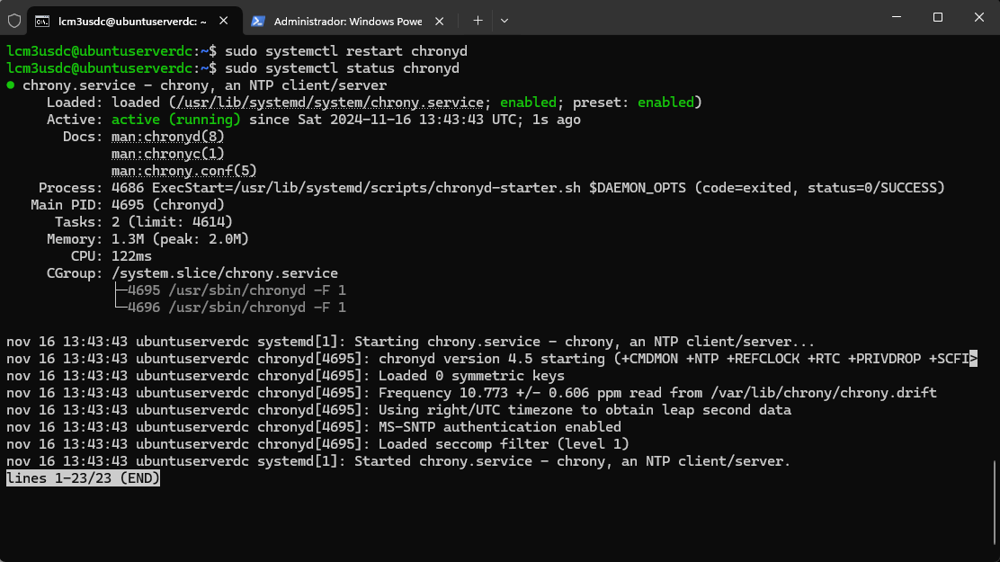

# Samba Active Directory en Ubuntu Server
#### ÍNDICE
- Configuración máquinas
- Servidor
  - Configuración Inicial
  - Instalación Samba AD
  - Configuración NTP
  - Configuración NFTABLES
  - Crear usuarios samba
- Cliente
  - Instalación aplicativos
  - Unión al dominio

#### Esquema red

|Máquina| SO | Usurario | Contraseña | IP |
|-------|----|------|----------------|-----|
|UbuntuServerDC| Ubuntu Server | lcm3USDC| abc123.|192.168.11.10|
|lcmUbuntuClient1| Ubuntu 22| lcm3UC1| abc123.|192.168.11.21|

Dominio  
dc=lcmASO,dc=local  
FQDN: lcmASO.local  

## Configuración máquinas
### Ubuntu Server
Creamos una VM nueva Ubuntu Server 24.01 en VirtualBox.  
   
   
   

Configuramos tres adaptadores de red para la máquina servidor.  
   
   
   

Arrancamos la máquina e instalamos el so, durante la instalación se nos va a solicitar,además del idioma de sistema y teclado, configurar la red.  
Dejamos la configuración por defecto para los tres adaptadores y continuamos con la instalación ya que la configuración de red la vamos a gestionar a través de netplan más adelante.  
  
Configuramos nombre de servidor y usuario.  
  
Cuando nos lo solicite instalamos OpenSSH para poder conectarnos de forma remota al server a través de SSH.  
  

Comprobamos que podemos acceder por SSH al servidor desde nuestro host a traves de la ip 192.168.56.101.    
  

### Ubuntu Client
Creamos una VM nueva Ubuntu Cliente 22.04 en VirtualBox.  
  
  
  

Configuramos un adaptador de red para la máquina en modo red interna.    
  

Arrancamos la máquina e instalamos el so.    
  
Configuramos nombre de equipo y usuario.    
  
Configuramos IP fija para cliente y añadimos la IP del servidor como servidor DNS  y como puerta de enlace.  
  

Los siguientes pasos los realizamos después de haber realizado el apartado *Configuración nftables*.    

Instalamos OpenSSH para poder conectarnos en remoto por ssh.    
  
Comprobamos podemos conectarnos via SSH desde el servidor.  
  

## Servidor
Conectamos con el servidor desde nuestro equipo host con ssh.  
Vamos a dar a nuestro servidor configuración de red para que el adaptador en red interna funcione con IP fja *192.168.11.10*.  
  

Una vez dentro del servidor con la configuración de red correcta comprobamos el hostname.  
  

Ahora vamos a modificar el archivo */etc/hosts* para indicarle al equipo tiene que atender las peticiones correspondientes al nombre de dominio **lcmubuntuserverdc.lcmASO.local**.  
  

Comprobamos como ahora nuestra maquina resuelve el nombre **ubuntuserverdc**.  
  

Ahora vamos a deshabilitar el servicio system-resolved ya que es incompatible con samba.    
  
También es necesario eliminar el enlace simbólico del archivo */etc/resolv.conf*.  
  
Y creamos de nuevo el archivo */etc/resolv.conf* añadiendo las siguientes lineas.  
  

Si queremos aseguramos de que el archivo no pueda ser modificado, ejecutamos:  
~~~
sudo chattr +i/etc/resolv.conf
~~~
Ahora vamos a proceder a instalar *Samba*, para esto primero actualizamos los repositorios.  
~~~
sudo apt-get update
~~~
Instalamos samba y sus dependencias.  
  

Deshabilitamos los servicios que tiene el servidor de AD que no vamos a utilizar porque samba no los requiere.    
  
  
Creamos una copia de seguridad del archivo */etc/samba/smb.conf*.  
~~~
sudo mv /etc/samba/smb.conf /etc/samba/smb.conf.cp
~~~
Aprovisionamos el servidor como *Samba Active Directory* e indicamos los datos que nos solicita.   
  
- Realm: FQDN
- Domain: nombre de dominio
- Server role: rol del servidor
- DNS backend: servidor DNS por defecto
- DNS forwarder IP: IP servidor DNS de reenvío, en este caso ponemos el de google ya que aquí se van a remitir las peticiones que no estén dentro de nuestro dominio.  
También añadimos la contraseña para administrador samba, en nuestro caso ponemos *abc123.* en un caso real debería ser una contraseña que cumpla ciertos criterios de seguridad.  

Antes de continuar vamos a crear una copia de seguridad de la configuración predeterminada de *kerberos*.    
~~~
sudo mv /etc/krb5.conf /etc/krb5.conf.cp  
~~~
Ahora sustituimos la configuración kerberos predeterminada por la generada por Samba.  
~~~
sudo cp /var/lib/samba/private/krb5.conf /etc/krb5.conf
~~~

Iniciamos el servidor samba.  
~~~
sudo systemctl start samba-ad-dc
~~~
Comprobamos que esta funcionando.  
  

### Configuración NTP
 Samba AD es dependiente del protocolo kerberos, este necesita que los tiempos del servidor AD y la estación de trabajo estén sincronizados, para esto configuramos un servidor NTP en Samba.  
 Cambiamos los permisos y la propiedad del directorio *ntp_signed* para que el usuario *_chrony* tenga permitido de lectura en el directorio.    
  
Modificamos el archivo de configuración */etc/chrony/chrony.conf* para habilitar el servidor NTP y que este apunte al servidor NTP de samba */var/lib/samba/ntp_signd*.    
  

- bindcmdaddress 192.168.56.102 : Dirección IP en la que chronyd escucha. 
- allow 192.168.56.0/24 : Permite que los clientes de la red 192.168.56.0/24 usen este servidor para sincronización NTP.
- ntpsigndsocket /var/lib/samba/ntp_signd : Socket utilizado para la firma NTP requerida para integrarse con un dominio Active Directory.

Reiniciamos y verificamos el estado del servicio NTP en el servidor.  
~~~
sudo systemctl restart chronyd
sudo systemctl status chronyd
~~~
   

### Configuración NFTABLES 
Para poder instalar los paquetes necesarios en nuestra máquina cliente necesitamos que esta tengo acceso a internet, para ello vamos a instalar nftables y crear una regla para que las peticiones de red de dicha máquina pasen por el servidor y sean redirigidas por el adaptador que el servidor tiene conectado en modo NAT y por lo tanto salida a internet.  

Primero debemos habilitar el reenvío de paquetes en el servidor.    
   

Para que la modificación permanezca al reiniciar el equipo.    
  

Instalamos nftables.    
~~~~
sudo apt-get install nftables
~~~~
Creamos una tabla nat.    
  
Creamos una cadena postrouting a la tabla nat añadiendo atributos aplicables a esta cadena.    
  

Añadimos una ruta a la tabla.   
  

Comprobamos que la regla se ha añadido a la tabla.  
  

Guardamos las reglas.    
   
   

Habilitamos el servicio y lo reiniciamos.  
   

Comprobamos como ya tenemos red desde el cliente.  
   

### Crear usuarios Samba
Nos logueamos en el server y creamos un usuario samba **lcm101usu**.   
  

## Cliente
Nos conectamos a la máquina cliente a través de ssh desde el host, para ello nos conectamos al server por ssh y una vez dentro del server nos conectamos por ssh al cliente.  
Ahora vamos a unir el equipo cliente al dominio.  

En primer lugar comprobamos el nombre del equipo cliente al verificar que es muy largo y el sistema nos va a devolver error procedemos a modificarlo por uno más corto, en este caso **lcmuc1**.  
  

Ahora modificamos el archivo */etc/hosts* para que resuelva al servidor Ubuntu ya configurado.    
  

### Instalación de aplicativos
Instalamos *ntpdate* para poder sincronizar los relojes de nuestras máquinas.   
~~~
sudo apt-get install ntpdate
~~~
Utilizamos la herramienta ntpdate para sincronizar.    
  

Instalamos los paquetes necesarios.    
  

### Unión al dominio
Realizamos una copia del archivo de configuración de samba.    
~~~
sudo mv /etc/samba/smb.conf /etc/samba/smb.conf.cp
~~~

Generamos un nuevo archivo */etc/samba/smb.conf*.    
  

Paramos los servicios samba que no son necesarios para nuestro cliente.   

~~~
sudo systemctl stop samba-ad-dc
~~~

Habilitamos los servicios samba.   
  

Ahora vamos a unir al cliente al dominio.  
  
*NOTA:El mensaje de error respecto al DNS es correcto, una vez lo hayamos configurado se resolverá*

Comprobamos como en la lista de equipos del servidor ya aparece nuestro equipo cliente **lcmuc1**.    
  

Configuramos la autenticación de cuentas AD.  
  

Reiniciamos el servicio winbind.  
~~~~
sudo systemctl restart winbind
~~~~

Listamos usuarios y grupos de dominio.    
  
  

Configuramos nuestro equipo para autenticarlo con cuentas de dominio y que se creen automáticamente los directorios a través del modulo *pam-auth*.  
~~~~
sudo pam-auth-update
~~~~
  
y modificando el archivo */etc/pam.d/common-account*.  
  

Comprobamos como ahora podemos acceder desde nuestro equipo cliente a un usuario de dominio **administrator**.    
  

El usuario administrator es un usuario samba AD por lo que no tiene permisos de sudo en los equipos locales, para solventar esto lo añadimos al archivo *sudoers*.    
~~~~
sudo usermod -aG sudo administrator
~~~~
Comprobamos como podemos acceder desde la máquina cliente con el usuario creado anteriormente *lcm101usu*,  también verificamos que se genera el directorio correspondiente para el usuario dentro del directorio */home*  
  

